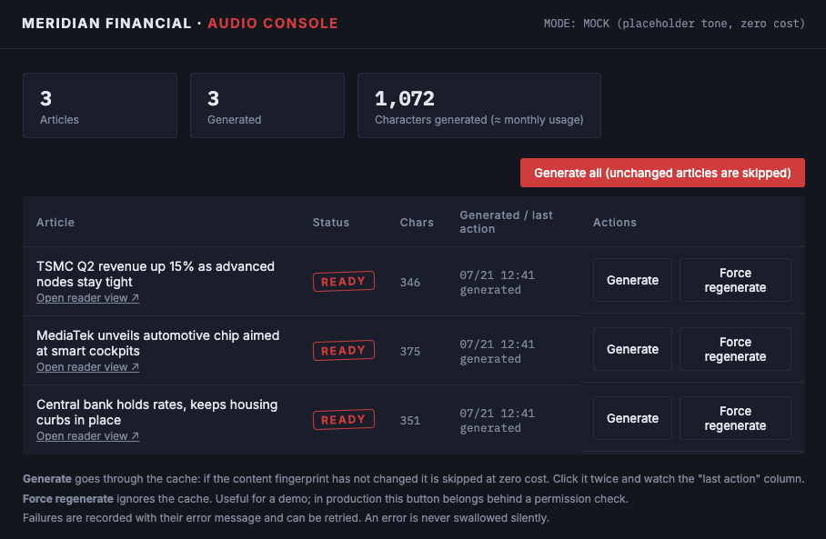
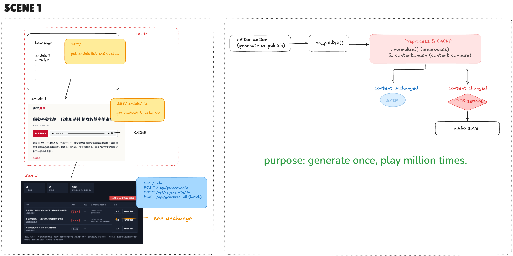

[English](README.md) | **繁體中文**

# Meridian Financial — Publisher TTS Pipeline PoC（Scenario 1）

> 註：程式碼、註解與介面一律英文；中文說明只在 `README.zh-TW.md` 提供。

模擬出版社「文章 → 語音」的完整流程：**讀者端文章頁**（秒播已生成語音）+ **編輯端語音管理後台**（生成 / cache / 失敗重試 / 成本追蹤）。

對應的客戶痛點：語音若跟著「讀者瀏覽」觸發，同一篇文章會被重複生成上千次（帳單 ×20 的經典事故）。本 PoC 證明正確架構：**發布時生成一次 → 存檔 → 所有讀者播同一份**。



*MOCK 模式下的編輯端後台。按兩次 Generate all，最後動作欄會變成 `skipped (unchanged)`——這就是內容指紋 cache，第二次一毛錢都沒花。*

## 快速開始

```bash
pip install -r requirements.txt
python app.py
# 讀者端  http://localhost:5001/
# 編輯端  http://localhost:5001/admin
```

**預設是 MOCK 模式**（不需要 API key）：生成一段提示音 WAV，零成本走通全流程——先在這個模式把介面和 cache 行為玩熟。

**切換 REAL 模式**（真的呼叫 ElevenLabs）：

```bash
export ELEVEN_KEY=你的APIkey          # 千萬不要寫進 code 或 commit
export ELEVEN_VOICE=voice_id          # 選填，預設官方範例聲音
export ELEVEN_MODEL=eleven_multilingual_v2   # 選填，預生成場景選品質模型
python app.py
```

## 建議的測試順序（每一步驗證一個設計決定）

1. 開編輯後台 → 按「生成全部」→ 三篇變「已生成」
2. **再按一次「生成全部」**→ 看「最後動作」欄全部變 `skipped (unchanged)`——這就是內容指紋 cache，一毛不花
3. 開讀者端任一篇 → 播放器秒播（讀者永遠只拿現成檔案）
4. 改 `data/articles.json` 裡任一篇的內文 → 回後台按「生成」→ 只有這篇重新生成
5. REAL 模式下：聽 a001 的語音——「(2330)」被逐位唸成 ticker、「15%」變成「15 percent」、「$34B」變成「34 billion dollars」，這是 `normalize()` 的功勞（財經文本不能直接餵 TTS）

## 架構

```
[編輯改 articles.json / 按生成]           讀者端
        │ on_publish()                      │ GET /article/<id>
        ▼                                   ▼
  normalize() 財經文本前處理          只讀 manifest + 播現成檔案
        │                             （零 API 呼叫、零成本）
  content_hash 比對 ──沒變──► skip
        │ 變了
  MOCK: 提示音 WAV / REAL: ElevenLabs TTS（retry + backoff 內建）
        │
  static/audio/ 存檔 + data/manifest.json 記錄狀態/字元/錯誤
```

## 檔案導覽

| 檔案 | 角色 |
|------|------|
| `tts_pipeline.py` | 核心管線：normalize、cache、雙模式生成、retry、manifest |
| `app.py` | Flask 路由：讀者端 2 頁 + 編輯端 1 頁 + 3 個 API |
| `data/articles.json` | 假文章（英文，內文刻意含股票代號、% 與金額，測 normalize 用） |
| `data/manifest.json` | 語音狀態庫（自動生成，後台的資料來源） |
| `templates/` | home / article / admin 三個頁面 |

## Productise note

「發布觸發 + 內容指紋 cache + 失敗可觀測」這組 pattern 對所有媒體客戶都成立——可以包成官方 SDK 的 publisher helper 或文件範例，客戶不必每家重造一次。

## 架構圖

發布時生成與 cache 流程（手繪圖，中文標註）：


