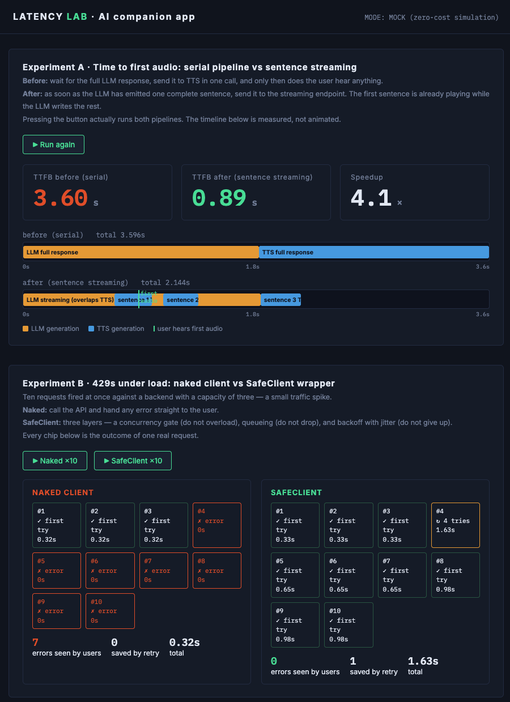

**English** | [繁體中文](README.zh-TW.md)

# Latency & 429 Lab — Streaming + SafeClient (Scenario 2)

**Read the Case Study:** 
- [From 3.6s to 0.9s: Cutting Voice Latency with Sentence Streaming](https://medium.com/@mimichen123/from-4-1s-to-0-8s-cutting-voice-latency-with-sentence-streaming-681497d5d94e) 
- [Stop DDoSing Yourself: A Three-Layer Client for Rate-Limited TTS APIs](https://medium.com/@mimichen123/stop-ddosing-yourself-a-three-layer-client-for-rate-limited-tts-apis-d0a8042b07bf?sharedUserId=mimichen123) 

Customer scenario: an AI companion app with two complaints — **users wait 5 seconds before hearing anything**, and **429 storms at peak hours**. This lab runs both fixes in a web UI and *measures* them instead of explaining them:

- **Experiment A | TTFB comparison**: serial pipeline (wait for the full LLM answer -> one TTS call) vs sentence streaming (fire streaming TTS as soon as the first sentence is complete). The timeline is a **real measured Gantt chart**, not an animation — after the fix, the LLM track (amber) and TTS track (blue) overlap; the green marker = the moment the user hears the first sound.
- **Experiment B | 429 stress test**: 10 concurrent requests against an API with capacity 3. Naked client (customer's status quo) vs SafeClient (concurrency gate -> queue -> backoff+jitter retry). Every chip on the wall is the fate of one real request: one-shot pass / retried & saved / user-visible error.



*Both experiments in one run: TTFB 3.60s to 0.89s (4.1x) with the overlapping LLM/TTS timeline underneath, and the chip wall showing 7 user-visible errors for the naked client versus 0 for SafeClient.*

## Quick Start

```bash
pip install -r requirements.txt
python app.py
# open http://localhost:5002/
```

**MOCK mode by default** (zero cost): a fake API simulates latency and a capacity cap with reproducible behaviour. Typical result on this machine:
serial TTFB ~3.6s -> streaming TTFB ~0.9s (**4x**); naked client 7 user-visible errors -> SafeClient **0**.

> These MOCK numbers come from the simulated backend, so they are reproducible but they are not
> a benchmark of the ElevenLabs API. Run REAL mode to measure your own network.

**REAL mode** (measures true TTFB):

```bash
cp .env.example .env   # fill in ELEVEN_KEY — never hardcode it
python app.py
```

Experiment A hits the real streaming endpoint (flash model) and measures **first-chunk time on your network** — write that number down; it's first-hand data. Experiment B will show **real 429s** on a Starter plan's low concurrency cap (max 16 requests, short texts, small credit cost — still watch your usage page).

## What each experiment proves

```
Experiment A: the cure for latency isn't "a faster API" — it's "stop waiting for the full LLM answer"
  before  [LLM full text#######][TTS full text####]^first sound   TTFB = sum of everything
  after   [LLM ###############]
               [s1 TTS#]^first sound [s2#] [s3#]                  TTFB ~ first-sentence time

Experiment B: three layers, each with one job
  gate (semaphore) blocks overload -> queue holds the rest, drops nothing -> retry (backoff+jitter) catches stray 429s
  (the gate is deliberately set to 4 > capacity 3, simulating "the customer doesn't know the real cap" —
   so you occasionally see a retried-and-saved chip)
```

## File Guide

| File | Role |
|------|------|
| `engine.py` | Lab engine: FakeTTS/RealTTS behind one interface, latency experiment, SafeClient's three-layer protection |
| `app.py` | Flask: 1 UI page + 2 experiment APIs |
| `templates/index.html` | Lab UI: stopwatch, Gantt tracks, chip wall |

## Productise note

SafeClient's "gate + queue + backoff retry" is the same requirement for every high-traffic customer — a good candidate for default behavior in the official SDKs, so customers stop discovering 429s the hard way.

## Architecture diagram

A hand-drawn diagram covering the streaming pipeline and the SafeClient internals is available at
[`docs/diagrams/02-streaming-latency.png`](../docs/diagrams/02-streaming-latency.png).

> Note: the diagram is annotated in Traditional Chinese. It is linked rather than embedded
> here so this page stays readable in English; the [繁體中文 README](README.zh-TW.md)
> embeds it inline.
