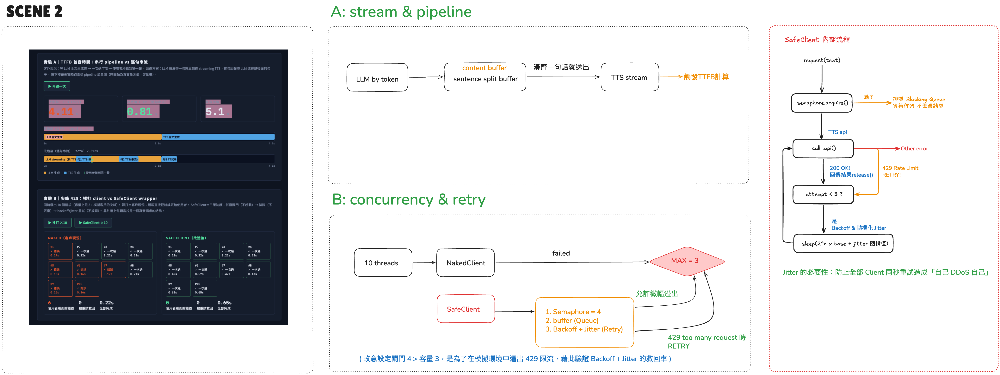

[English](README.md) | **繁體中文**

# 聲脈延遲實驗室 — Streaming & 429 Lab（Scenario 2）

> 註：程式碼、註解與介面一律英文；中文說明只在 `README.zh-TW.md` 提供。

對應客戶場景：AI 陪伴 App，兩個抱怨——**使用者等 5 秒才聽到聲音**、**尖峰時段狂噴 429**。
本實驗室用一個網頁介面，把兩個修法「跑給你看、量給你看」：

- **實驗 A｜TTFB 對比**：串行 pipeline（等 LLM 全文 → 一次 TTS）vs 逐句串流（首句湊齊立刻送 streaming TTS）。時間軸是**真實量測**畫出的甘特圖，不是動畫——LLM 軌跡（琥珀）與 TTS 軌跡（藍）在改造後互相重疊，綠色標線＝使用者聽到第一聲的瞬間。
- **實驗 B｜429 壓力測試**：同時發 10 個請求打進容量 3 的 API。裸打 client（客戶現況）vs SafeClient（併發閘門 → 排隊 → backoff+jitter 重試）。晶片牆上每顆晶片是一個真實請求的結局：✓ 一次過 / ↻ 重試救回 / ✗ 使用者看到錯誤。


*兩個實驗一次看完：TTFB 3.60 秒降到 0.89 秒（4.1 倍），下方甘特圖可見 LLM 與 TTS 重疊；晶片牆顯示裸打 7 個使用者錯誤、SafeClient 0 個。*

## 快速開始

```bash
pip install -r requirements.txt
python app.py
# 開 http://localhost:5002/
```

**預設 MOCK 模式**（零成本）：假 API 模擬延遲與容量上限，行為可重現。典型結果：
串行 TTFB ≈ 3.6s → 串流 TTFB ≈ 0.9s（**4×**）；裸打 7 個使用者錯誤 → SafeClient **0** 個。

> MOCK 的數字來自模擬後端，可重現，但**不是** ElevenLabs API 的效能基準。
> 想要你自己網路上的真實數字，請跑 REAL 模式。

**REAL 模式**（量真實 TTFB）：

```bash
export ELEVEN_KEY=你的APIkey     # 不要寫進 code
python app.py
```

實驗 A 會真打 streaming endpoint（flash 模型），量到的是**你網路環境下的真實首 chunk 時間**——把這個數字記下來，這是面試裡最強的第一手數據。實驗 B 在 Starter 方案的低併發上限下會看到**真實的 429**（請求數上限 16，短文本，credits 消耗很小，但仍請留意用量頁）。

## 兩個實驗各證明一件事

```
實驗 A：延遲的解藥不在「更快的 API」，在「不等 LLM 講完」
  改造前  [LLM 全文███████][TTS 全文████]▲首音          TTFB = 全部加總
  改造後  [LLM ███████████]
               [句1 TTS█]▲首音 [句2█] [句3█]            TTFB ≈ 首句時間

實驗 B：三層防護各司其職
  閘門(semaphore) 擋掉超載 → 佇列 讓多的排隊不丟棄 → retry(backoff+jitter) 接住漏網的 429
  （閘門故意設 4 > 容量 3，模擬「客戶不知道確切上限」——所以偶爾能看到 ↻ 重試救回）
```

## 檔案導覽

| 檔案 | 角色 |
|------|------|
| `engine.py` | 實驗引擎：FakeTTS/RealTTS 同介面、延遲實驗、SafeClient 三層防護|
| `app.py` | Flask：1 頁介面 + 2 個實驗 API |
| `templates/index.html` | 實驗室 UI：碼錶、甘特軌跡、晶片牆 |

## Productise note

SafeClient 的「閘門＋佇列＋backoff retry」對每個高流量客戶都是同一套需求——適合內建進官方 SDK 的預設行為，客戶不必每家自己踩一次 429 的坑。

## 架構圖

串流 pipeline 與 SafeClient 內部流程（手繪圖，中文標註）：


