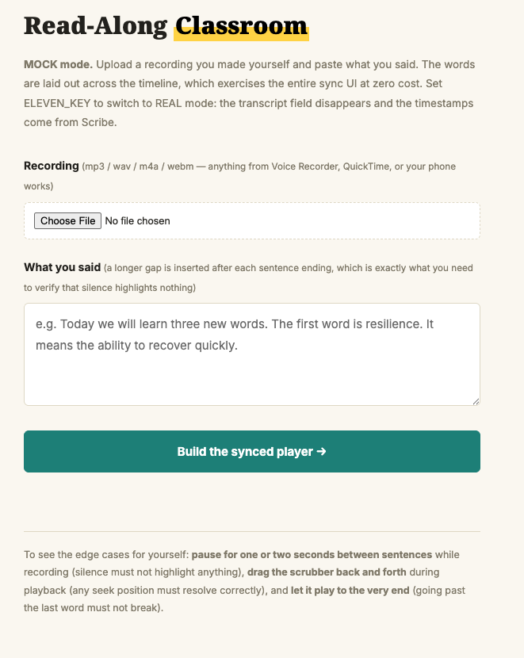
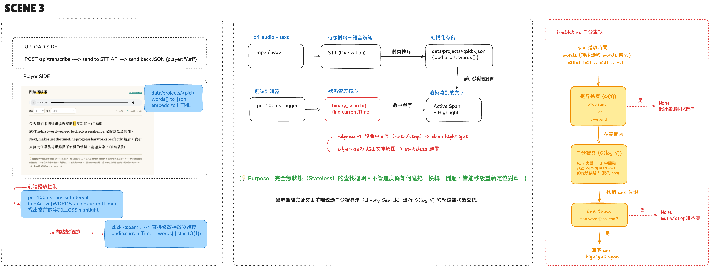

[English](README.md) | **繁體中文**

# 跟讀教室 — 字級同步播放器（情境 3）

> 註：程式碼、註解與介面一律英文；中文說明只在 `README.zh-TW.md` 提供。

客戶場景：語言學習產品要做 karaoke 式跟讀——唸到哪個字亮哪個字，點任一字音檔跳到該處。上傳錄音，拿到播放器。

本 PoC 證明兩個設計決定：

1. **對齊只做一次、離線做**——STT（Scribe，含 diarization）產出字級 timestamps 存成靜態 JSON，播放器永遠不打 API。
2. **播放查找完全無狀態**——前端每 100ms 跑 `findActive(words, audio.currentTime)`：對排序好的字陣列做**二分搜尋 O(log N)**。沒有游標、沒有會壞掉的狀態：進度條隨便亂拖、快轉、倒退，秒級重新定位。

處理的 edge cases（demo 裡刻意看得到）：
- 句間靜音 -> 不誤亮（End Check：`t <= words[ans].end`）
- 超出文本範圍 -> 無狀態歸零不爆炸（邊界檢查 O(1)）
- 反向點擊循跡：點任一 `<span>` -> `audio.currentTime = words[i].start`



*MOCK 模式請你連逐字稿一起貼上，系統把字鋪在錄音的真實長度上——不需要 API key 就能測完整套同步介面。*

## 快速開始

```bash
pip install -r requirements.txt
python app.py
# 開 http://localhost:5003/ -> 上傳錄音
```

**MOCK 模式（預設，免 API key）**：連逐字稿一起貼上，字會依長度鋪在音檔時間軸上（含句尾停頓）——零成本測完整同步 UI。

**REAL 模式**：`cp .env.example .env` 填 `ELEVEN_KEY` -> 上傳直接送 ElevenLabs STT（Scribe），拿真實字級 timestamps + 講者分離。

## 架構

```
UPLOAD SIDE                                    PLAYER SIDE
POST /api/transcribe                           GET /player/<pid>
  存音檔 -> mock/real STT                        讀靜態 JSON 配置
  -> data/projects/<pid>.json                    每 100ms：二分搜尋 findActive()
  { audio_url, words[] }                         命中 -> 亮 span；點 span -> 跳播放位置
```

## 售前要問什麼

1. 真的需要 realtime 轉錄嗎？（約 80% 不需要——batch 便宜且功能全）
2. 音源品質？單人或多人？（拿最難的樣本測 diarization）
3. 錄音合規：告知、保留期限、要不要 zero retention？

## 檔案導覽

| 檔案 | 角色 |
|------|------|
| `stt.py` | 轉錄層：mock/real 同介面 -> 帶 timestamps 的 words[] |
| `sync_logic.py` | 二分搜尋 + 邊界/End Check（純邏輯，可單元測試） |
| `app.py` | Flask：上傳頁、轉錄 API、播放器頁 |
| `templates/` | upload / player 兩頁 |

## 架構圖

離線對齊與播放時的查找邏輯（手繪圖，中文標註）：


