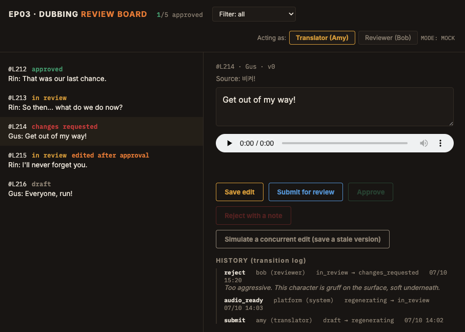

**English** | [繁體中文](README.zh-TW.md)

# Dubbing Review Command Center (Scenario 4)

Customer scenario: a localization team (translators, reviewers, the platform itself) works on the same episode's dubbed lines simultaneously. Without rules you get overwritten edits, illegal state jumps, and "who changed this?!". This PoC is a three-column review board backed by a **state machine with an audit trail**.

Five checkpoints on every action (`POST /api/action/<id>`):

1. **Optimistic locking** — request carries `version`; mismatch -> **409 Conflict** (nobody silently overwrites a colleague)
2. **Rules table** — `(state, action, role)` not in RULES -> **403 Forbidden** (legal roles can't make illegal moves)
3. **Post-approval edits** — editing an `approved` line flags `changed_after_approval` and force-rolls the workflow back to regeneration
4. **Audit trail** — every transition appended to `transitions[]` (who / when / what / comment), persisted in `store.json`
5. **Async regeneration** — if the next state is `regenerating`, a background thread generates TTS; on completion it self-applies `audio_ready` (role=system) and the line flows to REVIEW seamlessly

Frontend polling adapts: 1.2s fast poll while anything is regenerating, 4s slow poll otherwise.



*L215 carries the `edited after approval` flag and is back in review. Approve is greyed out because the rule table has no entry for a translator approving — and the server refuses it again regardless of what the button does.*

## Quick Start

```bash
pip install -r requirements.txt
python app.py
# open http://localhost:5004/
```

**MOCK mode (default)**: regeneration produces placeholder audio — the full workflow runs at zero cost.
**REAL mode**: `cp .env.example .env`, fill in `ELEVEN_KEY` (+ optional `ELEVEN_VOICE`/`ELEVEN_MODEL`).

Try it: use the "simulate concurrent conflict" button (sends a stale version) to watch 409 handling; reject a line as reviewer, then watch it flow submit -> regenerating -> in_review automatically.

## Pre-sales questions

1. Target languages and quality bar?
2. Script already available? (skipping STT improves quality)
3. Human-in-the-loop or fully automatic? (very different cost)
4. Is the original speaker's voice licensed for cloning?

## File Guide

| File | Role |
|------|------|
| `engine.py` | State machine: RULES table, optimistic lock, audit trail, async regen |
| `app.py` | Flask: board page + lines API + action API (403/409 mapping) |
| `templates/board.html` | Three-column board, adaptive polling, history drawer |
| `data/store.json` | Persisted lines + transitions (the audit ledger) |

## Architecture diagram

A hand-drawn diagram covering the five checkpoints every action passes through is available at
[`docs/diagrams/04-dubbing-review.png`](../docs/diagrams/04-dubbing-review.png).

> Note: the diagram is annotated in Traditional Chinese. It is linked rather than embedded
> here so this page stays readable in English; the [繁體中文 README](README.zh-TW.md)
> embeds it inline.
