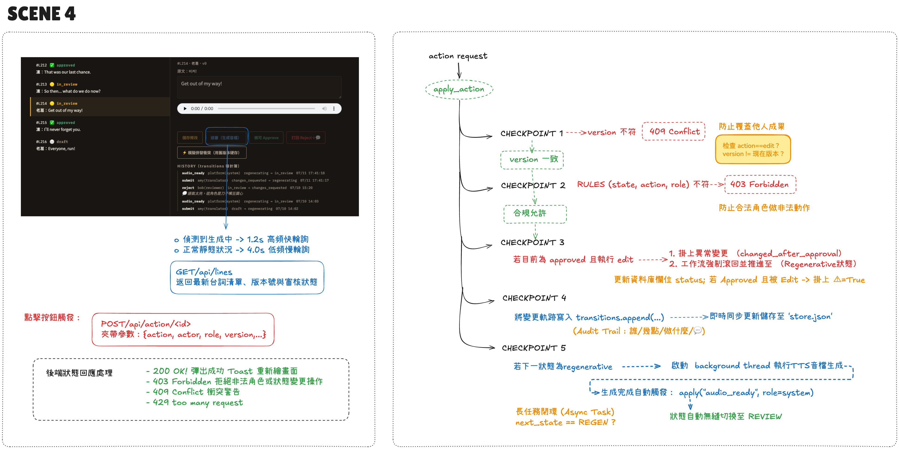

[English](README.md) | **繁體中文**

# 配音審核指揮中心（情境 4）

> 註：程式碼、註解與介面一律英文；中文說明只在 `README.zh-TW.md` 提供。

客戶場景：在地化團隊（譯者、審核員、平台本身）同時處理同一集的配音台詞。沒有規則就會互相覆蓋、狀態亂跳、「這誰改的？！」。本 PoC 是一個三欄式審核看板，背後是**帶 audit trail 的狀態機**。

每個動作（`POST /api/action/<id>`）過五道 checkpoint：

1. **樂觀鎖**——請求帶 `version`，不符 -> **409 Conflict**（防止默默覆蓋同事成果）
2. **規則表**——`(state, action, role)` 不在 RULES -> **403 Forbidden**（合法角色也做不了非法動作）
3. **核准後變更**——編輯 `approved` 的台詞 -> 掛上 `changed_after_approval` 異常標記，工作流強制滾回重生成
4. **Audit trail**——每次變更 append 進 `transitions[]`（誰/幾點/做什麼/留言），存進 `store.json`
5. **非同步重生成**——下一狀態是 `regenerating` 就開 background thread 生成 TTS，完成後自動 `apply("audio_ready", role=system)`，台詞無縫流到 REVIEW

前端輪詢自適應：偵測到生成中 -> 1.2s 快輪詢；靜態 -> 4s 慢輪詢。


*L215 掛著 `edited after approval` 標記並退回待審。Approve 是灰的，因為規則表裡沒有「譯者核可」這條路——而且不管前端按鈕怎麼做，後端都會再擋一次。*

## 快速開始

```bash
pip install -r requirements.txt
python app.py
# 開 http://localhost:5004/
```

**MOCK 模式（預設）**：重生成產出示意音檔，零成本跑完整工作流。
**REAL 模式**：`cp .env.example .env` 填 `ELEVEN_KEY`（可選 `ELEVEN_VOICE`/`ELEVEN_MODEL`）。

玩法：按「模擬併發衝突」（送舊版本號）看 409 處理；用 reviewer 身份 reject 一句，看它自動走 submit -> regenerating -> in_review。

## 售前要問什麼

1. 目標語言與品質要求？
2. 已有腳本嗎？（跳過 STT 品質更好）
3. human-in-the-loop 還是全自動？（成本差很多）
4. 原講者聲音授權談好了嗎？

## 檔案導覽

| 檔案 | 角色 |
|------|------|
| `engine.py` | 狀態機：RULES 表、樂觀鎖、audit trail、非同步重生成 |
| `app.py` | Flask：看板頁 + lines API + action API（403/409 對應） |
| `templates/board.html` | 三欄看板、自適應輪詢、歷史抽屜 |
| `data/store.json` | 台詞 + transitions 持久化（審計帳本） |

## 架構圖

每個動作會經過的五道關卡（手繪圖，中文標註）：


