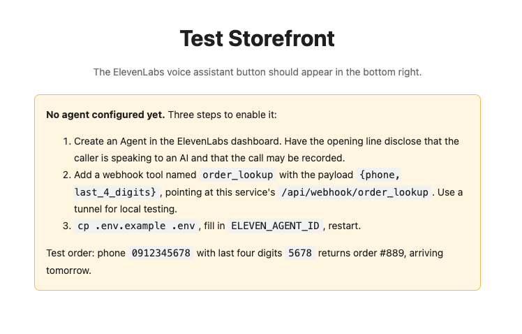
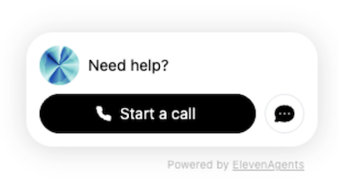

**English** | [繁體中文](README.zh-TW.md)

# E-commerce Voice Agent — widget + escalation (Scenario 5)

Customer scenario: an e-commerce site wants a voice agent in the corner of the page that can look up orders and hand complaints to a human. Fully managed by ElevenLabs Agents (ASR/LLM/TTS/barge-in). This PoC demonstrates two things:

1. **One-line widget embed** — `<elevenlabs-convai agent-id>` + script tag
2. **Backend middleware for tool calls** — the agent never touches the database directly; the webhook receives `{phone, last_4_digits}`, verifies identity server-side, and returns JSON. Identity-sensitive actions always live in the backend; never trust frontend input.

<table>
<tr>
<td width="60%"></td>
<td width="40%"></td>
</tr>
</table>

*Left: with no `ELEVEN_AGENT_ID` the page explains the three setup steps instead of failing silently. Right: once the id is set, the Agents widget appears in the corner.*

## Quick Start

```bash
pip install -r requirements.txt
cp .env.example .env   # fill in ELEVEN_AGENT_ID (without it, the page shows setup instructions)
python app.py          # http://localhost:5005
```

Agent dashboard setup (see the architecture diagram at the end of this page):
- Opening line: announce recording + disclose AI identity (compliance & expectation management)
- Tools: webhook `order_lookup`; for local testing, expose the URL to ElevenLabs via a tunnel
- Guardrails: sensitive keywords / negative sentiment -> escalation to a human with a handoff summary
- Archive call recordings and transcripts automatically; track containment rate

Test order: phone `0912345678` + last four digits `5678` -> order #889, arriving tomorrow.

## Pre-sales questions

1. Does full functionality require login? What differs between logged-in and anonymous?
2. Voice only, or also a text transcript?
3. Multilingual? Do the knowledge base and prompt split per language too?
4. Which situations must transfer to a human? To which extension/queue?

## Pitfalls

- Frontend trust: users can forge overrides to escalate privileges -> every backend tool re-verifies; set agent trust_context low
- Slow tools cause awkward silence -> pre-tool speech ("let me look that up") + soft-timeout filler

## Architecture diagram

A hand-drawn diagram covering the agent, webhook middleware and escalation path is available at
[`docs/diagrams/05-voice-agent.png`](../docs/diagrams/05-voice-agent.png).

> Note: the diagram is annotated in Traditional Chinese. It is linked rather than embedded
> here so this page stays readable in English; the [繁體中文 README](README.zh-TW.md)
> embeds it inline.
