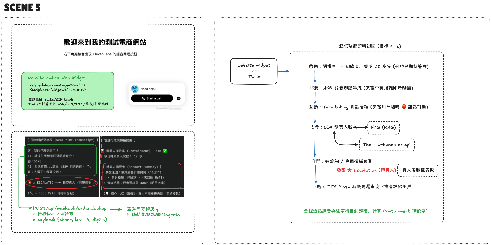

[English](README.md) | **繁體中文**

# 05 — 電商語音客服 Agent（widget + escalation）

> 註：程式碼、註解與介面一律英文；中文說明只在 `README.zh-TW.md` 提供。

對應客戶場景：電商想在網站右下角放語音客服，能查訂單、投訴時轉真人。
全託管走 ElevenLabs Agents（ASR/LLM/TTS/打斷處理），本 PoC 示範兩件事：

1. **widget 一行嵌入** —— `<elevenlabs-convai agent-id>` + script tag
2. **tool call 的後端中介層** —— agent 不直連資料庫，webhook 收 `{phone, last_4_digits}`
   後端驗證身份再回 JSON。身份動作永遠塞在後端，不信任前端輸入。

<table>
<tr>
<td width="60%"></td>
<td width="40%"></td>
</tr>
</table>

*左：沒設定 `ELEVEN_AGENT_ID` 時，頁面會說明三個設定步驟，而不是默默壞掉。右：填入 id 之後，Agents widget 就出現在角落。*

## 快速開始

```bash
pip install -r requirements.txt
cp .env.example .env   # 填入 ELEVEN_AGENT_ID（沒填會顯示設定教學頁）
python app.py          # http://localhost:5005
```

Agent 後台設定重點（對照本頁最後的架構圖）：
- 開場白：告知錄音 + 聲明 AI 身分（合規與期待管理）
- Tools：webhook `order_lookup`，本機測試用 tunnel 把 URL 曝露給 ElevenLabs
- Guardrail：敏感詞/負面情緒 → Escalation 轉真人（附 Handoff Summary）
- 通話錄音與逐字稿自動歸檔，計算 Containment 攔截率

## 售前要問什麼
1. 需要登入才有完整功能嗎？登入/未登入能力差異？
2. 只要語音還是也要文字 transcript？
3. 多語言需求？知識庫和 prompt 是否也要分語言？
4. 哪些情境必轉真人？轉給哪支分機/隊列？

## 坑
- 前端信任問題：使用者可偽造 override 提權 → 後端 tool 各自驗證，trust_context 設 low
- tool 呼叫慢造成尷尬沉默 → pre-tool speech（「我幫您查一下」）+ soft timeout filler

## 架構圖

Agent、webhook 中介層與轉真人路徑（手繪圖，中文標註）：


