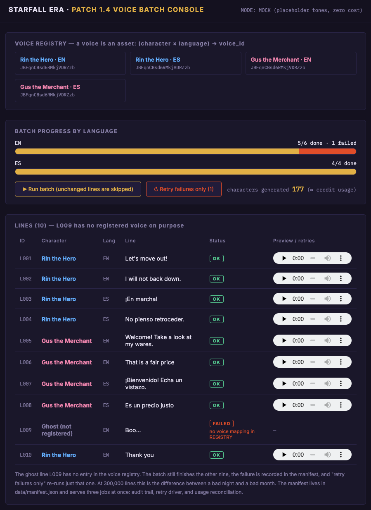
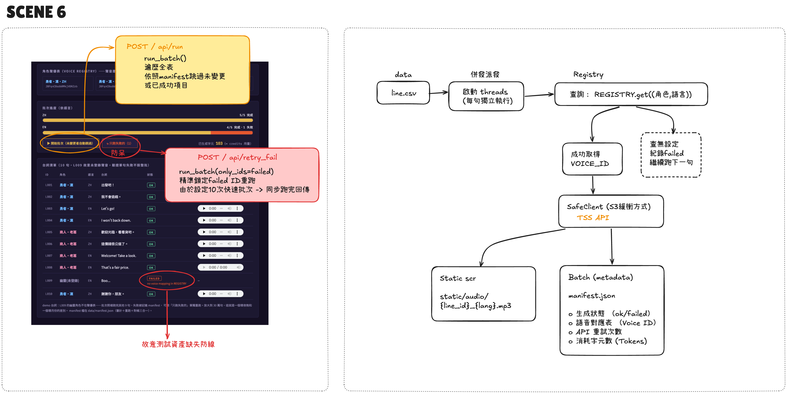

[English](README.md) | **繁體中文**

# 遊戲在地化批次控制台 — Patch 1.4（情境 6）

> 註：程式碼、註解與介面一律英文；中文說明只在 `README.zh-TW.md` 提供。

客戶場景：遊戲工作室要為多角色、多語言生成配音（本 demo 用英文與西班牙文）。10 句台詞時很可愛；30 萬句時，三件事決定你月底還活不活著：

1. **聲音是資產**——`REGISTRY: (角色, 語言) -> voice_id` 用對照表管理（吃環境變數），不散在程式裡。換一個授權聲音 = 改一格設定。
2. **單句失敗不毀整批**——查無聲音對應或 API 失敗，記進 manifest 繼續跑。CSV 裡故意放了一個沒登錄的「幽靈」角色驗證防線（L009 必失敗）。
3. **批次自帶防護**——重用情境 2 的 SafeClient（閘門+佇列+backoff/jitter）；批次任務最容易自己打爆自己的配額。

manifest（`data/manifest.json`）逐句記錄：ok/failed、用了哪個 voice_id、重試次數、消耗字元。這成就了那顆救命鍵：**「只重跑失敗的」**（`run_batch(only_ids=failed)`）——30 萬句規模下，全部重跑 vs 只重跑 47 句失敗，是一個月帳單等級的差別。



*九句成功，L009 因 `no voice mapping in REGISTRY` 失敗，批次照樣跑完。「Retry failures only (1)」只重跑那一句。*

## 快速開始

```bash
pip install -r requirements.txt
python app.py
# 開 http://localhost:5006/
```

**MOCK 模式（預設）**：每個 voice_id 給不同音高，零成本也「聽得出」不同角色不同聲音。
**REAL 模式**：`cp .env.example .env` 填 `ELEVEN_KEY`，去 Voice Library 挑授權可商用的聲音填入 `VOICE_HERO_EN` / `VOICE_HERO_ES` / `VOICE_MERCHANT_EN` / `VOICE_MERCHANT_ES`。

玩法：「開始批次」-> 9/10 成功、L009 失敗（no voice mapping）->「只跑失敗的」精準重跑那一句。連按兩次批次 -> 已成功且未變更的全部 skip（manifest 驅動的冪等性）。

## 售前要問什麼

1. 角色 x 語言矩陣多大？聲音都授權可商用嗎？
2. 台詞量級？（10 句和 30 萬句是兩個世界）
3. 遊戲術語的發音詞庫誰維護？

## 檔案導覽

| 檔案 | 角色 |
|------|------|
| `engine.py` | REGISTRY、MockTTS/RealTTS、SafeClient、manifest 驅動的 run_batch |
| `app.py` | Flask：控制台頁 + run/retry_failed API |
| `data/lines.csv` | 台詞來源（含刻意設下的幽靈角色陷阱） |
| `data/manifest.json` | 逐句 status/voice/retries/chars——控制台的資料來源 |

## 架構圖

對照表、批次執行器與重試迴圈（手繪圖，中文標註）：


